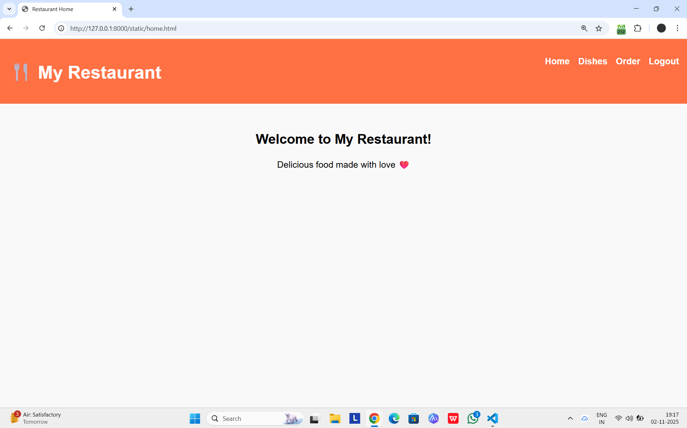
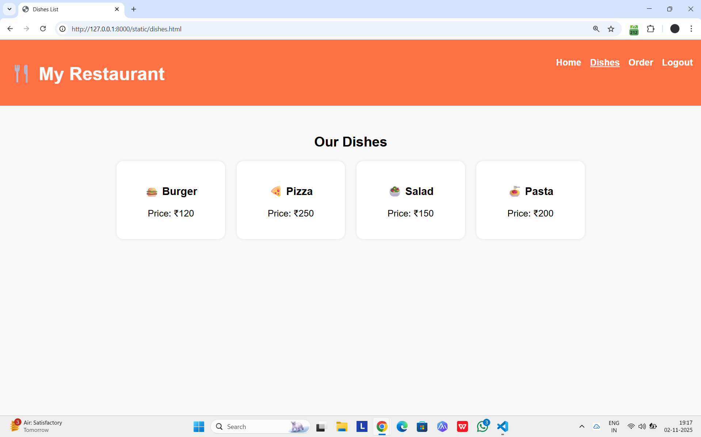
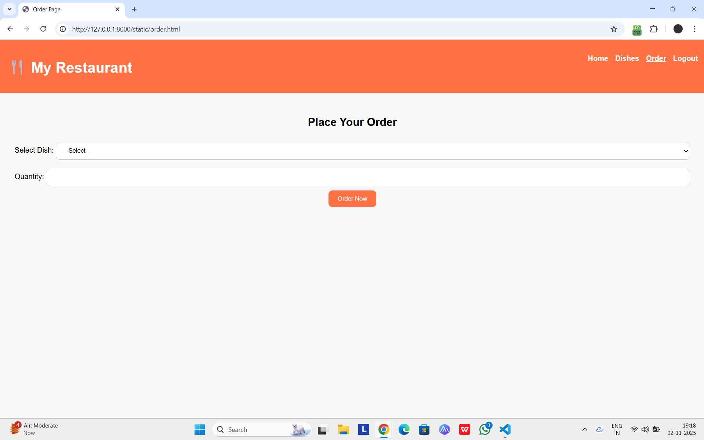

# Ex.07 Restuarant Website
## Date: 30-10-2025

## AIM:
To develop a static Resturant website to display the menu and services provided by the resturant.

## DESIGN STEPS:

### Step 1:
Requirement collection.

### Step 2:
Creating the layout using HTML and CSS.

### Step 3:
Updating the sample content.

### Step 4:
Choose the appropriate style and color scheme.

### Step 5:
Validate the layout in various browsers.

### Step 6:
Validate the HTML code.

### Step 7:
Publish the website in the given URL.

## PROGRAM:
#### index.html:
```
<!DOCTYPE html>
<html lang="en">
<head>
  <meta charset="UTF-8">
  <meta name="viewport" content="width=device-width, initial-scale=1.0">
  <title>Restaurant Login</title>
  <link rel="stylesheet" href="style.css">
</head>
<body>
  <div class="container">
    <h2>🍽️ Restaurant Login</h2>
    <form onsubmit="return loginUser()">
      <input type="text" id="username" placeholder="Enter Username" required>
      <input type="password" id="password" placeholder="Enter Password" required>
      <button type="submit">Login</button>
    </form>
  </div>

  <script>
    function loginUser() {
      const user = document.getElementById('username').value;
      const pass = document.getElementById('password').value;

      if (user === "Jagan" && pass === "Jagan") {
        window.location.href = "home.html";
      } else {
        alert("Invalid login credentials!");
      }
      return false;
    }
  </script>
</body>
</html>
```
#### home.html:
```
<!DOCTYPE html>
<html lang="en">
<head>
  <meta charset="UTF-8">
  <meta name="viewport" content="width=device-width, initial-scale=1.0">
  <title>Restaurant Home</title>
  <link rel="stylesheet" href="style.css">
</head>
<body>
  <nav>
    <h1>🍴 My Restaurant</h1>
    <ul>
      <li><a href="home.html">Home</a></li>
      <li><a href="dishes.html">Dishes</a></li>
      <li><a href="order.html">Order</a></li>
      <li><a href="index.html">Logout</a></li>
    </ul>
  </nav>

  <section class="content">
    <h2>Welcome to My Restaurant!</h2>
    <p>Delicious food made with love ❤️</p>
  </section>
</body>
</html>
```
#### dishes.html:
```
<!DOCTYPE html>
<html lang="en">
<head>
  <meta charset="UTF-8">
  <meta name="viewport" content="width=device-width, initial-scale=1.0">
  <title>Dishes List</title>
  <link rel="stylesheet" href="style.css">
</head>
<body>
  <nav>
    <h1>🍴 My Restaurant</h1>
    <ul>
      <li><a href="home.html">Home</a></li>
      <li><a href="dishes.html" class="active">Dishes</a></li>
      <li><a href="order.html">Order</a></li>
      <li><a href="index.html">Logout</a></li>
    </ul>
  </nav>

  <section class="dishes">
    <h2>Our Dishes</h2>
    <div class="dish-list">
      <div class="dish-card">
        <h3>🍔 Burger</h3>
        <p>Price: ₹120</p>
      </div>
      <div class="dish-card">
        <h3>🍕 Pizza</h3>
        <p>Price: ₹250</p>
      </div>
      <div class="dish-card">
        <h3>🥗 Salad</h3>
        <p>Price: ₹150</p>
      </div>
      <div class="dish-card">
        <h3>🍝 Pasta</h3>
        <p>Price: ₹200</p>
      </div>
    </div>
  </section>
</body>
</html>
```
#### order.html:
```
<!DOCTYPE html>
<html lang="en">
<head>
  <meta charset="UTF-8">
  <meta name="viewport" content="width=device-width, initial-scale=1.0">
  <title>Order Page</title>
  <link rel="stylesheet" href="style.css">
</head>
<body>
  <nav>
    <h1>🍴 My Restaurant</h1>
    <ul>
      <li><a href="home.html">Home</a></li>
      <li><a href="dishes.html">Dishes</a></li>
      <li><a href="order.html" class="active">Order</a></li>
      <li><a href="index.html">Logout</a></li>
    </ul>
  </nav>

  <section class="order">
    <h2>Place Your Order</h2>
    <form onsubmit="return placeOrder()">
      <label>Select Dish:</label>
      <select id="dish" required>
        <option value="">-- Select --</option>
        <option>Burger</option>
        <option>Pizza</option>
        <option>Salad</option>
        <option>Pasta</option>
      </select>

      <label>Quantity:</label>
      <input type="number" id="qty" min="1" required>

      <button type="submit">Order Now</button>
    </form>

    <p id="msg"></p>
  </section>

  <script>
    function placeOrder() {
      const dish = document.getElementById('dish').value;
      const qty = document.getElementById('qty').value;
      if (dish && qty > 0) {
        document.getElementById('msg').innerText = `✅ Order placed for ${qty} ${dish}(s)!`;
      } else {
        document.getElementById('msg').innerText = `⚠️ Please fill all fields.`;
      }
      return false;
    }
  </script>
</body>
</html>
```

## OUTPUT:






## RESULT:
The program for designing software company website using HTML and CSS is completed successfully.
